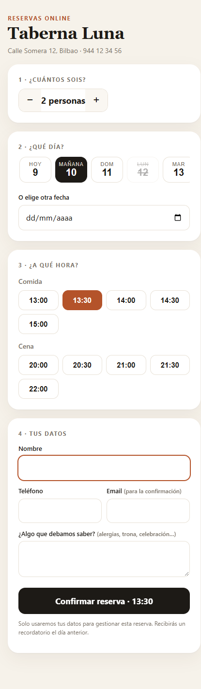
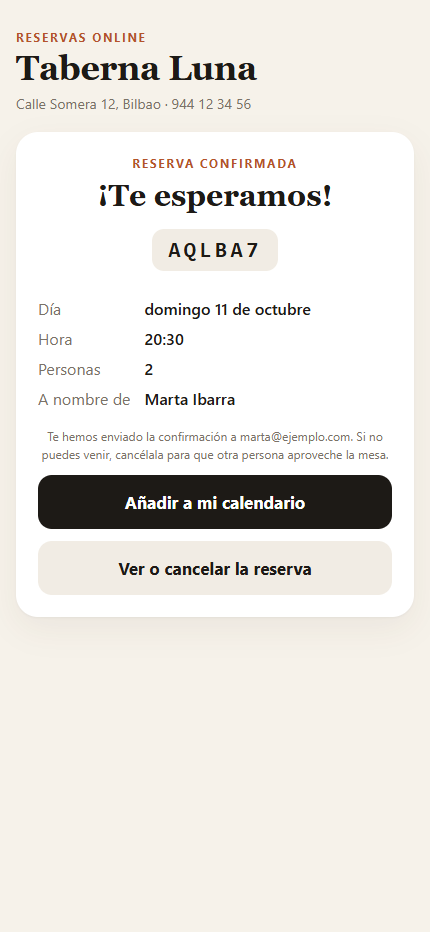
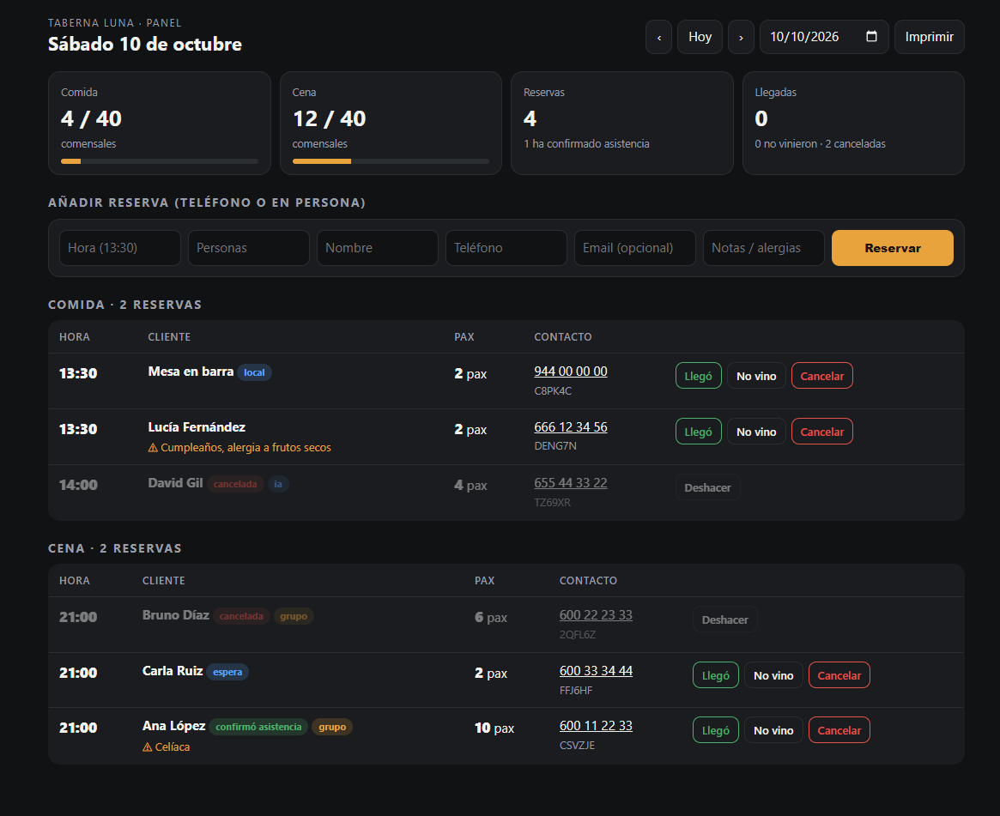
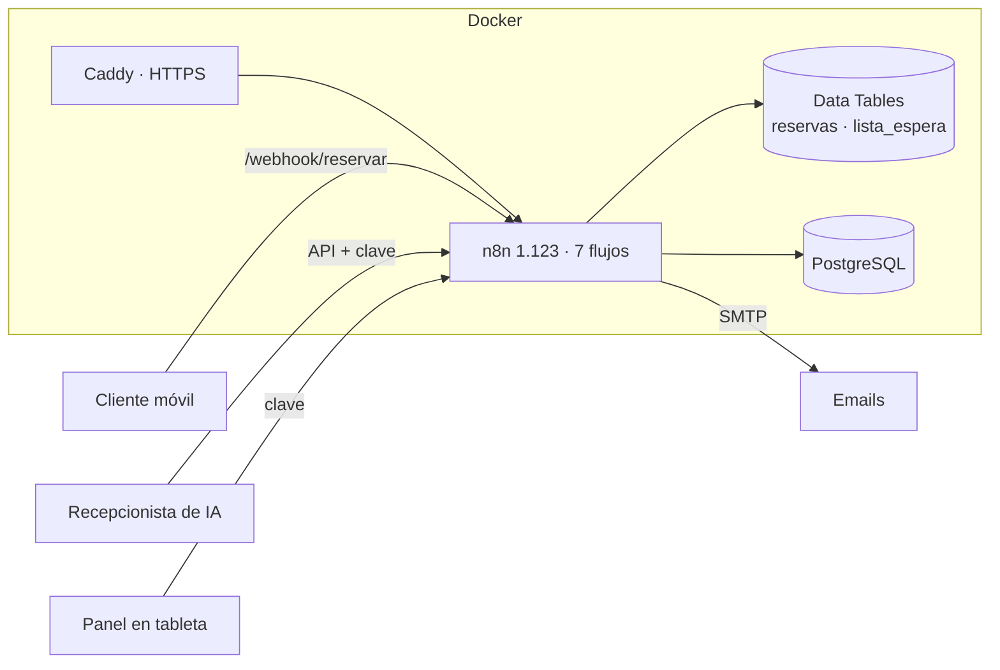

# reservas-n8n

**Automatización completa de reservas para restaurantes con n8n.** Cubre todo el ciclo: el cliente reserva desde el móvil, recibe la confirmación y un recordatorio, y puede cancelar con un clic. La mesa liberada se asigna sola a quien estaba en lista de espera, y al día siguiente se le pide una reseña en Google. El restaurante solo abre su panel.


| Reserva desde el móvil | Confirmación | Panel del restaurante |
|---|---|---|
|  |  |  |

## Qué trabajo quita

| Antes | Con reservas-n8n |
|---|---|
| Coger el teléfono en pleno servicio para apuntar reservas | **El cliente reserva solo**, 24 horas, viendo únicamente las horas con sitio |
| Llamar el día antes para confirmar | **Recordatorio automático** con botones «Sí, allí estaremos» y «No podemos ir» |
| Mesas vacías por cancelaciones de última hora | **Lista de espera automática**: la mesa liberada se reserva sola al siguiente y se le avisa |
| Saturar la cocina con 40 personas a la misma hora | **Ritmo de entradas** por franja de 30 minutos, además del aforo por turno |
| Pedir reseñas a mano (o no pedirlas) | **Email de reseña** al día siguiente, solo a quien vino y una sola vez |
| Repasar la libreta cada mañana | **Informe diario** con ocupación, alergias y ausencias del día anterior |
| Atender el teléfono para reservar | **Funciones listas para un recepcionista de IA** ([guía](docs/recepcionista-ia.md)) |

## Flujos

| Flujo | Qué hace |
|---|---|
| **01 · Reservas: web y API** | Página pública, disponibilidad, creación con validación, duplicados, aforo, alternativas y lista de espera. |
| **02 · Gestión del cliente** | Ver, confirmar asistencia o cancelar desde el enlace del email (por POST, para que los antivirus de correo no cancelen al abrir el enlace), y cancelación por teléfono con código y teléfono. |
| **03 · Recordatorio** | Cada hora entre las 10:00 y las 21:00. Avisa a quien reserva para mañana, sin duplicados y no a quien ha reservado hace menos de 3 horas. |
| **04 · Reseña** | A las 12:00, a los clientes del día anterior que vinieron. |
| **05 · Lista de espera** | Al liberarse sitio y cada 30 minutos. Asigna por orden de llegada la hora más cercana a la preferida. |
| **06 · Panel** | Reservas del día con alergias, llegadas, ausencias, alta de reservas telefónicas y recarga automática. |
| **07 · Informe diario** | A las 9:00, para el dueño. |

## Arquitectura



- **Sin servicios externos de pago.** Las reservas viven en las Data Tables de n8n, sobre PostgreSQL. Solo hace falta un correo SMTP.
- **Flujos generados por código.** `scripts/build.mjs` construye los siete flujos a partir de una librería común (`src/lib.js`): disponibilidad, validación y plantillas. No hay lógica duplicada entre flujos y todo se revisa con git.
- **Instalación con un comando.** `scripts/setup.mjs` crea el administrador, las tablas y la credencial, e importa y activa los flujos. Se puede repetir sin duplicar nada.
- **Seguridad:**
  - tokens aleatorios de 144 bits en los enlaces y códigos de 6 caracteres sin letras ambiguas,
  - claves para el panel y el agente, y campo trampa contra bots,
  - textos escapados en HTML y emails, `x-frame-options` y cancelación solo por POST,
  - n8n escuchando solo en el propio equipo, detrás de Caddy.

## Probarlo en local

Necesitas Docker y Node 18 o superior.

```bash
cp .env.example .env              # y cambia las contraseñas y claves
docker compose --profile dev up -d
node scripts/build.mjs            # genera workflows/*.json
node scripts/setup.mjs            # instala y activa los flujos
node scripts/e2e.mjs              # 43 comprobaciones de principio a fin
```

| Qué | Dirección |
|---|---|
| Reservas | http://localhost:5680/webhook/reservar |
| Panel | http://localhost:5680/webhook/panel?clave=TU_CLAVE |
| Emails capturados (Mailpit) | http://localhost:8025 |
| Editor de n8n | http://localhost:5680 |

La prueba recorre lo que pasaría en una semana real:
- reservas y validaciones,
- aforo lleno y lista de espera,
- cancelación con mesa reasignada sola,
- reservas por la IA, panel, recordatorios sin duplicados, informe y reseña.

Comprueba cada email recibido y cada dato guardado.

## Producción

Ver [docs/produccion.md](docs/produccion.md): un VPS de 5–8 € al mes con Docker, HTTPS automático, correo real y copias de seguridad.

## Configuración

Todo está en `.env`: nombre, aforo por turno, ritmo de entradas, horas, días de cierre, antelación mínima, tamaño máximo de grupo, enlace de reseñas y claves. Ver [`.env.example`](.env.example).

## Próximos pasos

- Recordatorios y confirmaciones por WhatsApp Business API.
- Asignación de mesas concretas sobre un plano del local.
- Señal o tarjeta en garantía para grupos y fechas especiales.

---

Hecho por [Hodei Medina](https://github.com/hodeione) · [DH Technology](https://h-com-bay.vercel.app) · MIT
