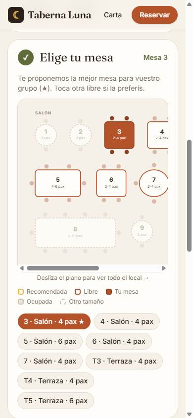
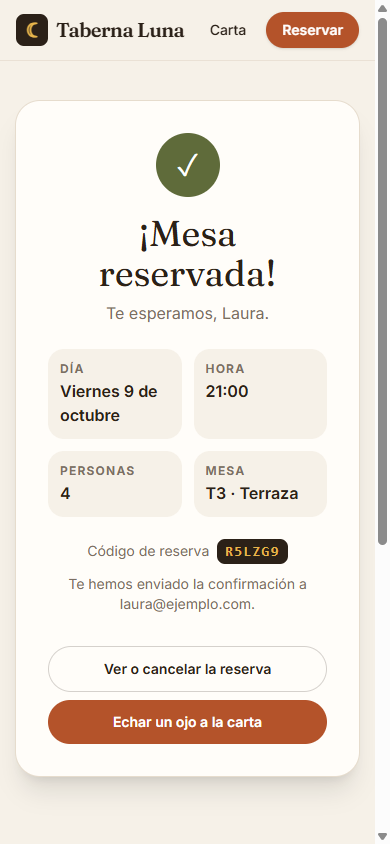
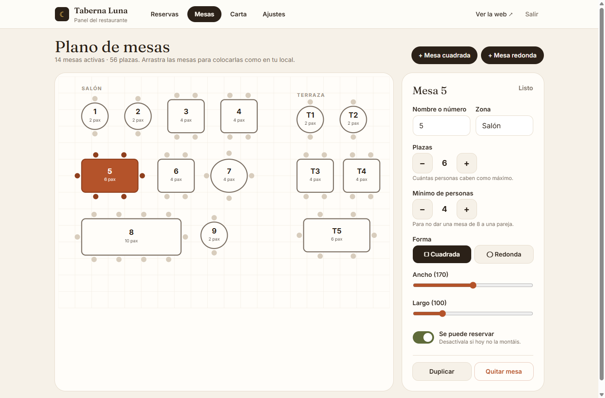
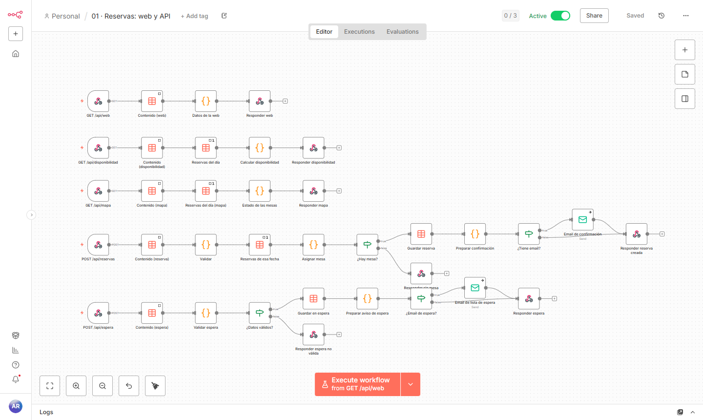
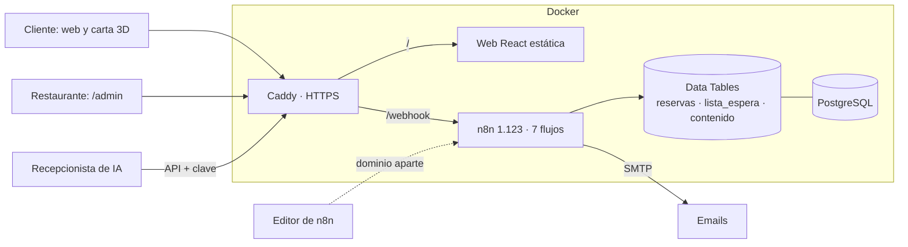

# reservas-n8n

**Web, reservas con plano de mesas y carta digital en 3D para restaurantes, automatizadas con n8n.**

El cliente entra en la web del restaurante y elige su mesa en el plano del local. Recibe la confirmación al momento, un recordatorio el día antes y puede cancelar con un clic. Si cancela, la mesa pasa sola al siguiente de la lista de espera. En la mesa, escanea un QR y ve los platos en 3D, incluso colocados sobre la mesa con la cámara del móvil. El restaurante lo gestiona todo desde un panel sencillo, sin tocar código ni n8n.


| Elegir mesa en el plano | Carta en 3D | Reserva confirmada |
|---|---|---|
|  |  |  |

## Para el cliente

- **Web del restaurante** con portada, platos destacados en 3D, horario, mapa y teléfono.
- **Reserva en cuatro toques:** personas, día, hora y mesa. Solo se ofrecen horas con sitio, y se propone la mesa que mejor encaja con el grupo (★). El cliente puede elegir otra libre en el plano.
- **Carta digital** con filtros de dieta y de los 14 alérgenos obligatorios.
- **Platos en 3D** que se giran con el dedo. En móviles compatibles, el botón «Verlo en tu mesa» los coloca a tamaño real con realidad aumentada (WebXR, Scene Viewer y Quick Look).
- **Lista de espera** si la hora está completa: la mesa se asigna sola cuando alguien cancela.

## Para el restaurante

El panel está en `/admin` y funciona en el móvil, la tableta y el ordenador. Se entra con la clave del restaurante.

| Reservas del día | Editor del plano | Editor de la carta |
|---|---|---|
|  |  |  |

| Pestaña | Qué se hace |
|---|---|
| **Reservas** | Sala en vivo por hora, cifras del día y lista con alergias. Botones de «Ha llegado», «No vino», «Cancelar», «Deshacer» y «Cambiar mesa». Una reserva telefónica se apunta tocando una mesa libre. |
| **Mesas** | Arrastrar mesas para dibujar el local. Plazas, mínimo de personas, forma, tamaño, zona (salón, terraza…) y mesas desactivadas. |
| **Carta** | Secciones y platos, precio, alérgenos, etiquetas, agotado y destacado. El modelo 3D se elige de una galería con vista previa. |
| **Ajustes** | Días de apertura, horas de reserva, duración de cada turno, días cerrados sueltos, reglas de reserva, datos del local y QR imprimible para las mesas. |

Todo lo que se guarda se valida en el servidor y se ve en la web al momento.

## Qué trabajo quita

| Antes | Con reservas-n8n |
|---|---|
| Coger el teléfono en pleno servicio para apuntar reservas | **El cliente reserva solo**, 24 horas, eligiendo mesa |
| Cuadrar mesas en una libreta | **Asignación automática** de la mesa más ajustada al grupo, respetando cuánto dura cada turno |
| Llamar el día antes para confirmar | **Recordatorio automático** con botones «Sí, allí estaremos» y «No podemos ir» |
| Mesas vacías por cancelaciones de última hora | **Lista de espera automática** que hereda la mesa liberada |
| Saturar la cocina con 40 personas a la misma hora | **Ritmo de llegadas** por franja, además de las mesas libres |
| Reimprimir la carta por cada cambio | **Carta digital** que se edita desde el móvil, con platos agotados en un toque |
| Pedir reseñas a mano | **Email de reseña** al día siguiente, solo a quien vino y una sola vez |
| Repasar la libreta cada mañana | **Informe diario** con ocupación, alergias y ausencias |
| Atender el teléfono para reservar | **API lista para un recepcionista de IA** ([guía](docs/recepcionista-ia.md)) |

## Flujos de n8n



| Flujo | Qué hace |
|---|---|
| **01 · Reservas: web y API** | Datos de la web, disponibilidad, estado de cada mesa a una hora, creación con asignación de mesa y lista de espera. |
| **02 · Gestión del cliente** | Ver, confirmar asistencia o cancelar desde el enlace del email, por POST para que los antivirus del correo no cancelen al abrirlo. Cancelación por teléfono con código y teléfono. |
| **03 · Recordatorio** | Cada hora entre las 10:00 y las 21:00, para quien reserva mañana. Sin duplicados. |
| **04 · Reseña** | A las 12:00, a los clientes del día anterior que vinieron. |
| **05 · Lista de espera** | Al liberarse una mesa y cada 30 minutos. Asigna mesa por orden de llegada. |
| **06 · Administración** | Datos del panel, guardado validado de ajustes, plano y carta, cambios de estado y de mesa. |
| **07 · Informe diario** | A las 9:00, para el dueño. |

## Arquitectura



- **La web** (`web/`) es React 19, TypeScript y Tailwind, servida como archivos estáticos. El visor 3D (`@google/model-viewer`) y el panel se descargan solo cuando hacen falta.
- **n8n es el backend.** Toda la lógica vive en flujos: disponibilidad, mesas, emails, tareas programadas y administración. Web y API comparten dominio, así que no hay CORS.
- **Contenido editable sin código.** Ajustes, plano y carta se guardan como documentos JSON en una Data Table y se validan antes de guardarse.
- **Flujos generados por código.** `scripts/build.mjs` construye los siete flujos a partir de una librería común (`src/lib.js`), sin lógica duplicada y revisable con git.
- **Modelos 3D** del [Food Kit de Kenney](https://kenney.nl/assets/food-kit) (dominio público, CC0), con textura incrustada y escalados a tamaño real para la realidad aumentada.
- **Seguridad:**
  - tokens aleatorios de 144 bits en los enlaces y códigos de 6 caracteres sin letras ambiguas,
  - claves para el panel y el agente, y campo trampa contra bots,
  - textos escapados en HTML y emails, y cancelación solo por POST,
  - n8n escuchando solo en el propio equipo y su editor en un dominio separado.

## Probarlo en local

Necesitas Docker y Node 18 o superior.

```bash
cp .env.example .env                       # y cambia las contraseñas y claves
(cd web && npm ci && npm run build)        # genera web/dist
docker compose --profile dev up -d
node scripts/build.mjs                     # genera workflows/*.json
node scripts/setup.mjs                     # instala los flujos y los datos de muestra
node scripts/e2e.mjs                       # 71 comprobaciones de principio a fin
```

| Qué | Dirección |
|---|---|
| Web del restaurante | http://localhost:8088 |
| Carta digital | http://localhost:8088/carta |
| Panel del restaurante | http://localhost:8088/admin (clave `REST_CLAVE_PANEL` del `.env`) |
| Emails capturados (Mailpit) | http://localhost:8025 |
| Editor de n8n | http://localhost:5680 (`N8N_ADMIN_EMAIL` y `N8N_ADMIN_PASSWORD` del `.env`) |

Para desarrollar la web con recarga en caliente: `cd web && npm run dev`. La API se redirige a n8n.

La prueba de principio a fin recorre una semana real:
- la web, el plano y la elección de mesa,
- mesas ocupadas durante todo el turno y mesas de otro tamaño,
- lista de espera que hereda la mesa cancelada,
- reservas de la IA y del personal, y cambios de mesa,
- edición del plano, la carta y los ajustes, con su validación,
- recordatorios sin duplicados, informe y reseña.

Comprueba cada email recibido y cada dato guardado. Al acabar deja la configuración, el plano y la carta como estaban.

## Producción

Ver [docs/produccion.md](docs/produccion.md): un VPS de 5–8 € al mes con Docker, HTTPS automático, correo real y copias de seguridad.

## Próximos pasos

- Fotos reales de los platos y modelos 3D propios hechos por fotogrametría.
- Recordatorios y confirmaciones por WhatsApp Business API.
- Señal o tarjeta en garantía para grupos y fechas especiales.

---

Hecho por [Hodei Medina](https://github.com/hodeione) · [DH Technology](https://h-com-bay.vercel.app) · MIT
