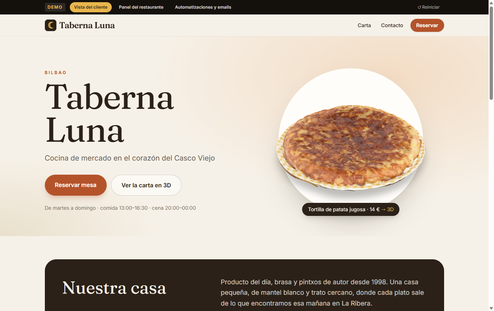
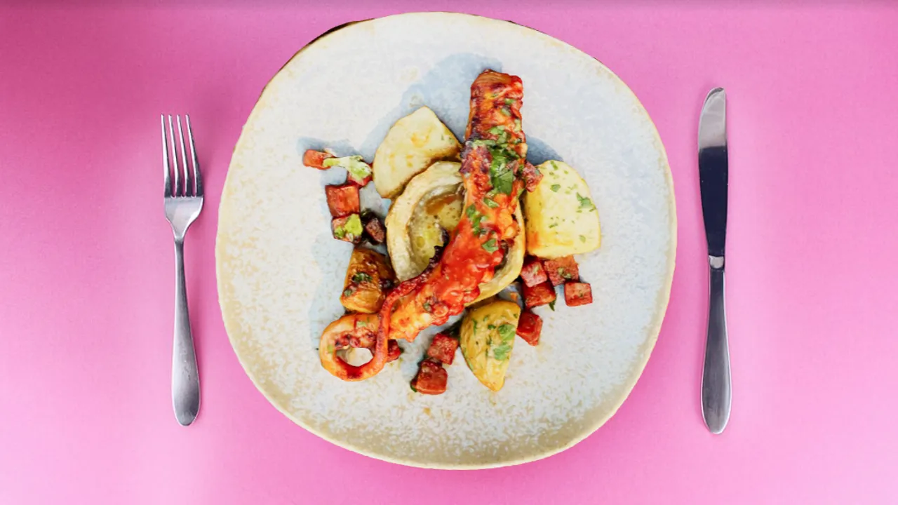
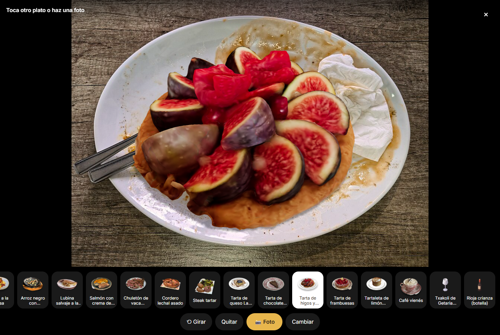
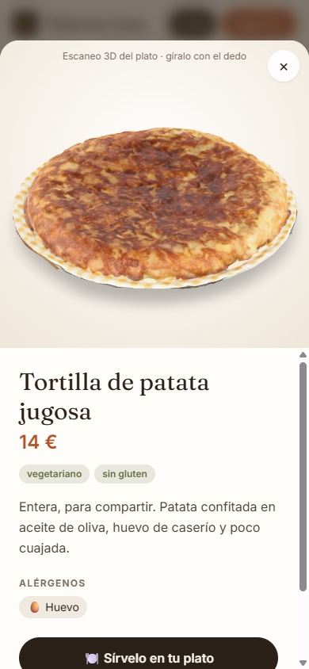
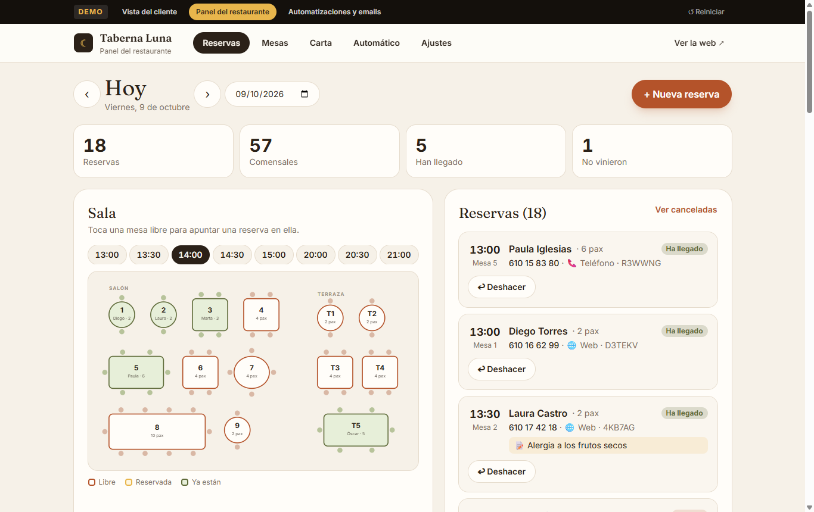
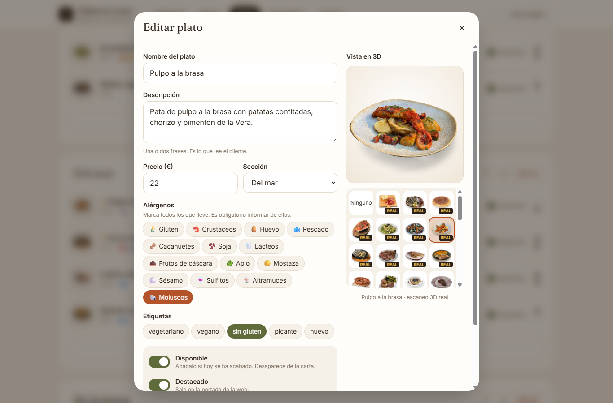
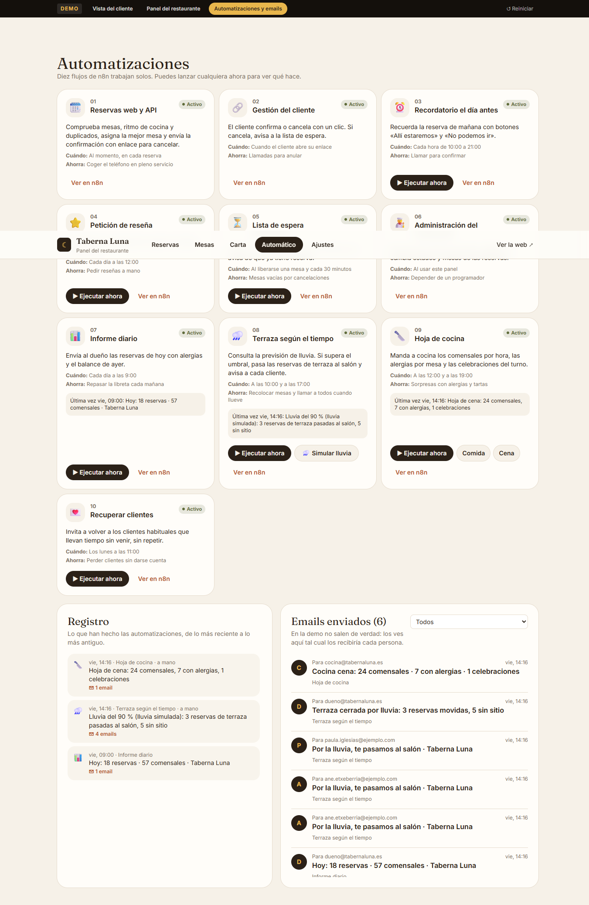
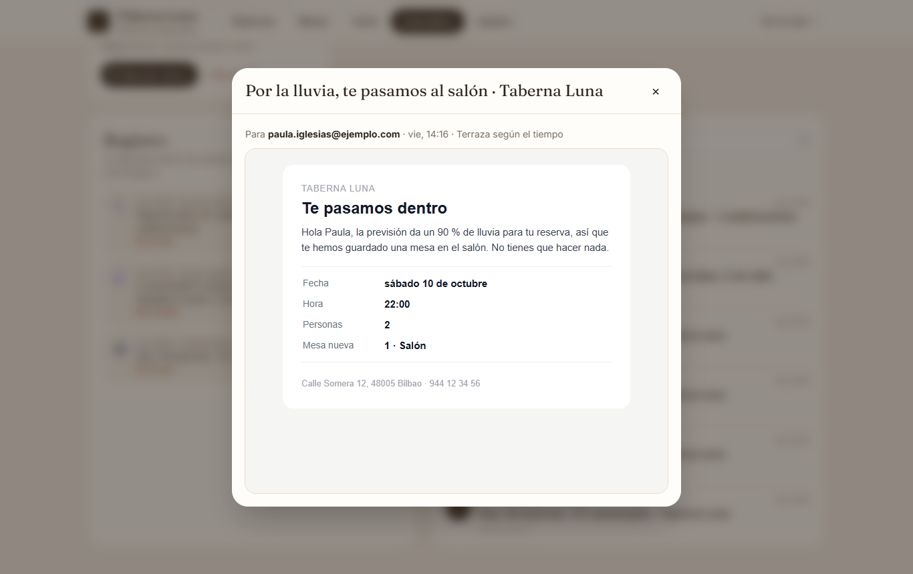
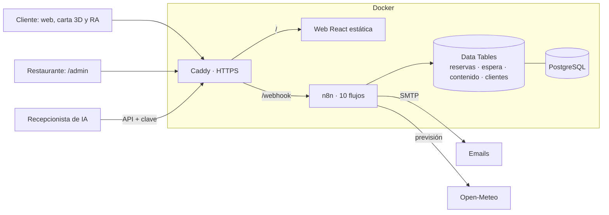

# reservas-n8n

**Web, reservas con plano de mesas y carta con platos reales en 3D para restaurantes, con diez automatizaciones de n8n.**

### [▶ Probar la demo en vivo: Taberna Luna](https://taberna-luna-dht.vercel.app)

En la demo se puede usar todo:
- **la web del cliente:** reserva eligiendo mesa y carta 3D,
- **el panel del restaurante:** sala en vivo, plano, carta y horarios,
- **las automatizaciones:** se lanzan a mano y se leen los emails que envían.

La demo ejecuta en el navegador la misma librería que usa n8n en producción.



## Sírvelo en tu plato: realidad aumentada en cualquier móvil

Se apunta el móvil a un **plato vacío** y, al tocarlo, aparece encima el plato de la carta a su tamaño, con sombra, y sigue al plato si mueves el móvil. No necesita ARCore, ARKit ni ninguna app. Funciona en cualquier móvil con cámara y navegador, y en el ordenador sobre una foto.

| Sobre un plato real | Plato en ángulo, mesa de madera | Ficha 3D en el móvil |
|---|---|---|
|  |  |  |

Cómo funciona, en `web/src/lib/detectorPlato.ts`:
1. **Gradiente** de la imagen a 320 px.
2. **Rayos** desde el punto tocado, buscando los bordes fuertes.
3. **Elipse por RANSAC.** Entre el fondo y el ala, se queda con el ala del plato. Los cubiertos, las servilletas y la comida no le afectan.
4. **Pose 3D.** Con la elipse calcula la distancia y la inclinación del plato. La cámara virtual usa la misma focal, así que el plato 3D cae exactamente sobre el real.

El plato se detecta en 10–30 ms por fotograma, así que se sigue en tiempo real. En móviles compatibles también está la realidad aumentada nativa a tamaño real (WebXR, Scene Viewer y Quick Look).

**Platos reales.** Los 19 platos son escaneos fotogramétricos de comida de verdad (CC BY, vía Objaverse y Sketchfab), entre ellos:
- tortilla de patata, pulpo a la brasa y arroz negro,
- chuletón, ostras y tarta de queso vasca.

`scripts/platos-3d.mjs` los procesa:
- los centra y los escala a su tamaño real en metros,
- sirve en un plato de cerámica generado los que vienen sin plato,
- comprime la geometría con meshopt y las texturas en WebP. Pasan de 1–15 MB a 0,1–1,2 MB.

Los créditos de cada escaneo están en `web/src/creditos-3d.json` y en la ficha de cada plato.

## Para el restaurante, sin código

| Reservas del día | Editor de la carta | Automatizaciones |
|---|---|---|
|  |  |  |

| Pestaña | Qué se hace |
|---|---|
| **Reservas** | Sala en vivo por hora y lista con alergias. Marca clientes habituales, ausencias anteriores y celebraciones. Botones de llegada, no presentado, cancelar, deshacer y cambiar de mesa. |
| **Mesas** | El plano del local se dibuja arrastrando mesas: plazas, mínimo, forma, tamaño y zona. |
| **Carta** | Secciones, platos, precios, 14 alérgenos y etiquetas. El modelo 3D se elige de una galería con vista previa. |
| **Automático** | Las diez automatizaciones, con su registro y un botón para lanzarlas. En la demo, además, la bandeja con todos los emails enviados. |
| **Ajustes** | Días y horas, duración de cada turno, cierres, reglas de reserva, umbral de lluvia para la terraza, emails de dueño y cocina, y QR imprimible de la carta. |

## Diez automatizaciones

| Flujo | Cuándo | Qué hace |
|---|---|---|
| **01 · Reservas** | En cada reserva | Comprueba mesas libres durante todo el turno, ritmo de cocina y duplicados. Asigna la mesa más ajustada y confirma por email. |
| **02 · Gestión del cliente** | Desde su enlace | Confirma o cancela con un clic, por POST para que los antivirus del correo no cancelen. |
| **03 · Recordatorio** | Cada hora, de 10 a 21 | Recuerda la reserva de mañana con «Allí estaremos» y «No podemos ir». |
| **04 · Reseña** | A las 12:00 | Pide reseña en Google a quien vino ayer, una sola vez. |
| **05 · Lista de espera** | Al liberarse sitio | La mesa cancelada pasa sola al primero de la lista, que recibe la reserva hecha. |
| **06 · Administración** | Desde el panel | Guarda ajustes, plano y carta validados, y cambia estados y mesas. |
| **07 · Informe diario** | A las 9:00 | Reservas de hoy con alergias y balance de ayer para el dueño. |
| **08 · Terraza según el tiempo** | A las 10:00 y 17:00 | Consulta la previsión de Open-Meteo. Si la lluvia supera el umbral, pasa las reservas de terraza al salón, avisa a cada cliente y manda al dueño las que no caben. |
| **09 · Hoja de cocina** | A las 12:00 y 19:00 | Comensales por hora, alergias por mesa y celebraciones del turno. |
| **10 · Recuperar clientes** | Los lunes | Invita a volver a los clientes habituales que llevan tiempo sin venir, sin repetir. |



## Arquitectura



- **Una sola lógica.** Disponibilidad, mesas, lista de espera, emails, terraza, cocina y clientes viven en `src/lib.js`. `scripts/build.mjs` genera los diez flujos de n8n con esa librería. La demo la ejecuta tal cual en el navegador, con el reloj de Madrid.
- **La web** es React 19, TypeScript y Tailwind. three.js, el visor 3D y el panel solo se descargan cuando hacen falta.
- **Sin servicios de pago.** Los datos están en las Data Tables de n8n, sobre PostgreSQL. La previsión del tiempo es gratuita y sin clave. Solo hace falta un correo SMTP.
- **Seguridad:**
  - tokens de 144 bits en los enlaces,
  - claves para el panel y el agente,
  - campo trampa contra bots,
  - textos escapados y validación en el servidor de todo lo que se guarda,
  - el editor de n8n en un dominio separado.

## Probarlo en local

Necesitas Docker y Node 18 o superior.

```bash
cp .env.example .env                       # y cambia las contraseñas y claves
(cd web && npm ci && npm run build)        # genera web/dist
docker compose --profile dev up -d
node scripts/build.mjs                     # genera workflows/*.json
node scripts/setup.mjs                     # instala los flujos y los datos de muestra
node scripts/e2e.mjs                       # 79 comprobaciones de principio a fin
```

| Qué | Dirección |
|---|---|
| Web del restaurante | http://localhost:8088 |
| Panel del restaurante | http://localhost:8088/admin (clave `REST_CLAVE_PANEL`) |
| Emails capturados (Mailpit) | http://localhost:8025 |
| Editor de n8n | http://localhost:5680 |

Para la demo sin servidor: `cd web && VITE_DEMO=1 npm run dev`.

La prueba de principio a fin recorre una semana real del restaurante:
- reservas con elección de mesa y lista de espera que hereda la mesa,
- reservas de la IA y del personal,
- edición del plano, la carta y los ajustes,
- terraza con lluvia y hoja de cocina con alergias y cumpleaños,
- invitación a clientes que no vuelven, recordatorios, informe y reseñas.

Comprueba cada email recibido y cada dato guardado.

## Producción

Ver [docs/produccion.md](docs/produccion.md): un VPS de 5–8 € al mes con Docker, HTTPS automático, correo real y copias de seguridad. La demo pública se publica en Vercel con `vercel.json`.

---

Hecho por [Hodei Medina](https://github.com/hodeione) · [DH Technology](https://h-com-bay.vercel.app) · MIT. Modelos 3D de sus autores bajo CC BY (ver créditos).
